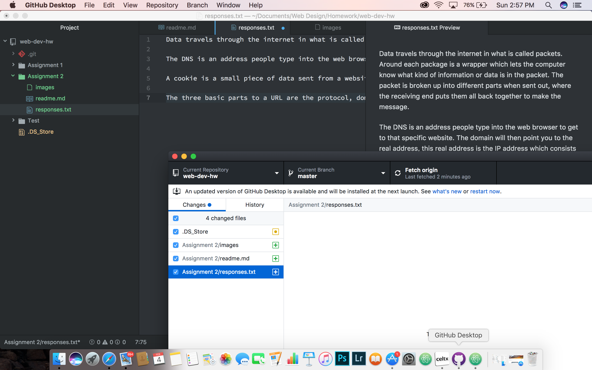

# Assignment 2
A version control system allows the individual to keep track and manage changes in projects they're working on. Github is an example of a VCS.

My [responses](./responses.txt).

This assignment for this week was really helpful in understanding the basics of how things on the internet operate. To complete this weeks tasks, I followed along with the examples provided. I did find myself creating errors, which caused it not to work at first, but found it to be spelling mistakes and it all worked. The mini quizes also helped me by giving me the confidence to correctly go about labeling and linking items together.

.
