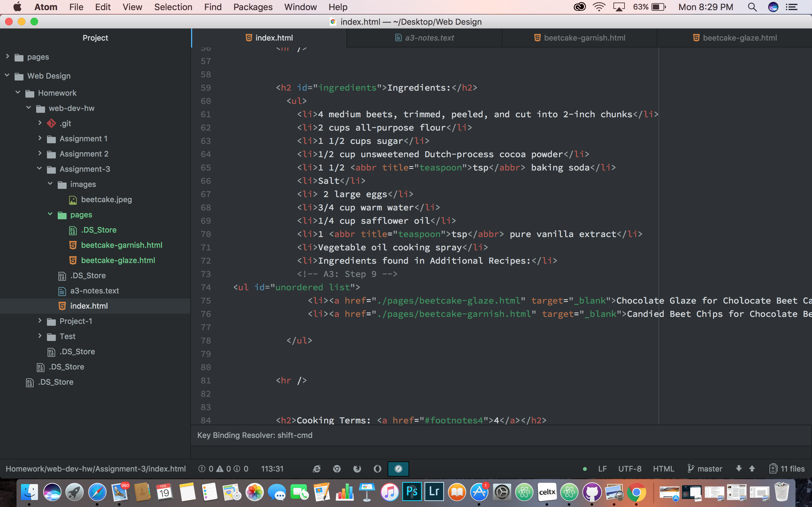

# Assignment 4 ReadMe

A page can have as many heads and bodies as they want. The head contains meta data about your site that others cannot see, while the body contains the rest of the information.

Semantic markup is a markup language such as HTML that conveys information about the meaning of each element in a document through proper selection of markup elements. Semantic Markup also maintains complete separation between the markup and the visual presentation of the elements contained within a document like we did calling something "strong".
Structural markupembeds information about th structure of a document headings, paragraphs, breaks and lists. The text reading from left to right on the webpage, it also descibes the purpose of the text and how it will appear on the web browser.

This work cycle we learned how to properly set up a webpage, using different styles of markdown. I started off by going through the readings, from there I followed the examples given in the readings to complete this homework assignment. I had some problems with the superscript, I followed the example but it was not showing up that it worked.

