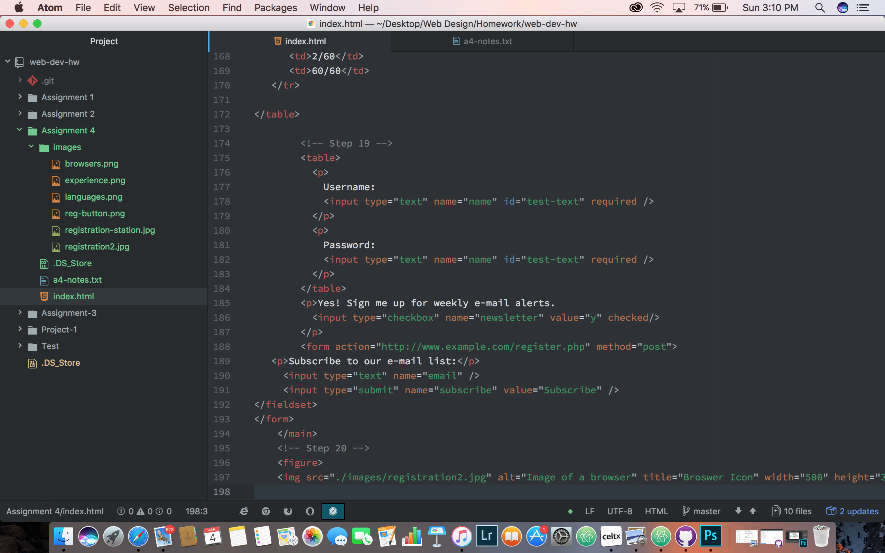

## Benjamin Agosto A:4 Readme
Alt text is a word or phrase that can be seen on a webpage either as text or used in a picture to help the visually impared. Alt text was used mostly in this lessons assignment, allowing the students to create their own links with alt text.
While browsing the web, I never really noticed all the alt-text forms that have been used, mainly I noticed the forms for gaming websites. These sites will have the player characters as clickable links to previews of a new game.
During this homewrok cycle I relied heavily on the notes from the online portion to help guide me through this and the examples given by the instructor helped as well. Working through this assignment with a study partner has helped me pregress through the homework because we are able to catch eachothers mistakes and explain something to the other if one doesn't get it. This assignment was worked through again heavily using the guides and online content.

