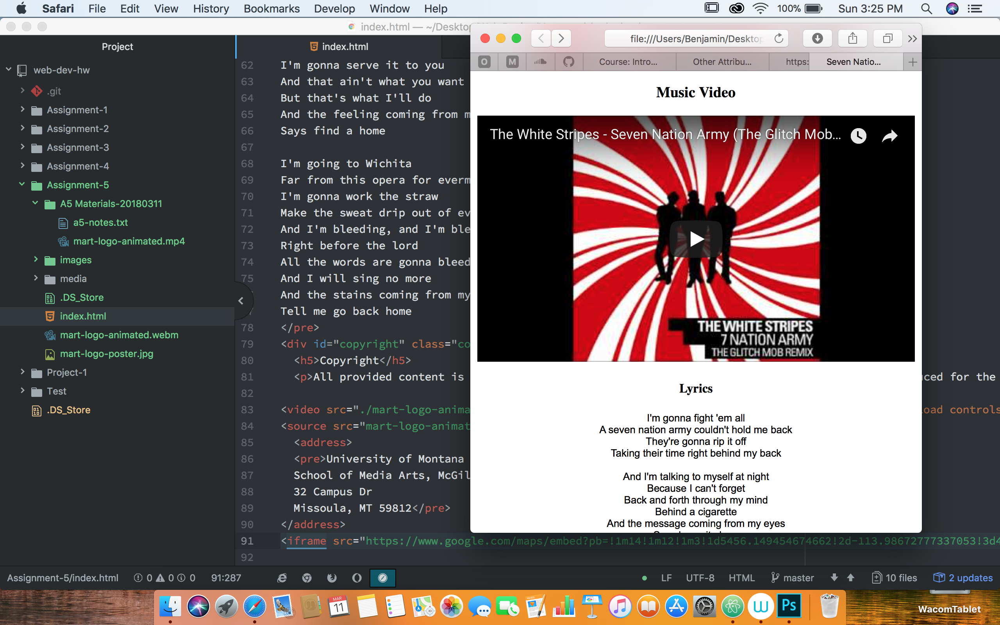

# Agosto Assignment 5 readme

# Different Attributes
The I.D. attribute takes as its value a string, which should be a "unique identifier" to that specific element.--ID given to one element should be different from every other element's ID on a page.
The class attribute is an identifier and selector value for HTML elements. The class attribute groups similar types of elements together by using the same unique name value.
The divs element offers developers a block-level element to group other elements together.
The span serves to identify or group content together that requires organization or extra styling. You can have multiple span elements inside a div. One specific use for the span element is to identify text that needs to appear visually unique on the rendered HTML page.

# Hosted Media
The advantage of using a hosted media provider over self-hosted media is that you can upload a high-quality version of your media and these sites will handle compatibility, encoding, and the other details necessary for the media to play on a variety of browsers.

# Summary
This work cycle we worked with different attributes that help organize and keep a webpage looking clean. Then used a website where we hosted differnt types of media players to play on our site. This homework cycle I stuck to the instructions and looked over the learning area pretty vigilently. Although while working through the assignment, I had difficuties getting the media arts video to play, I had checked my code against a buddy of mines and I still have no idea what I am doing wrong there. This assignment was a little more difficult to me because the end part of the instructions started to get a little fuzzy to me with the additional attributes and sources.

