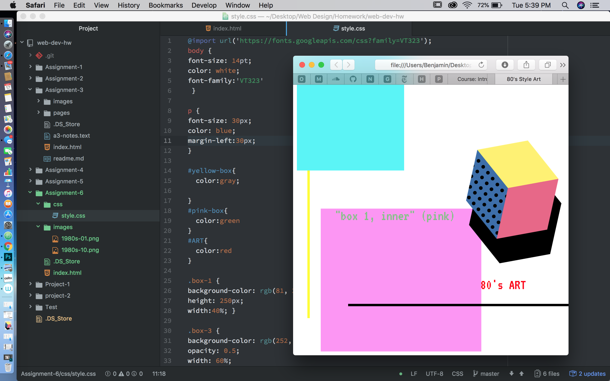

# Agosto, Benjamin A:8 Intro to CSS

This week was are first inroduction using css styling and cascading within our code.
Using gaphics from the 80's I tried to give the color scheme the same feel as done
in the 80's. I also used blocky boxes and panned them out across the page to give it a retro
vibe that was very boxy feeling.
My color palette consisted of three colors:
Blue: rgb(81, 244, 247)
Pink: rgb(252, 22, 235)
Yellow: rgb(249, 252, 22)
This assignment was way more difficult than I had expected. Using the code provided and then being
able to mess around with it helped alot. I had no shame when asking for help and used the office hours
to get a handle on things.

