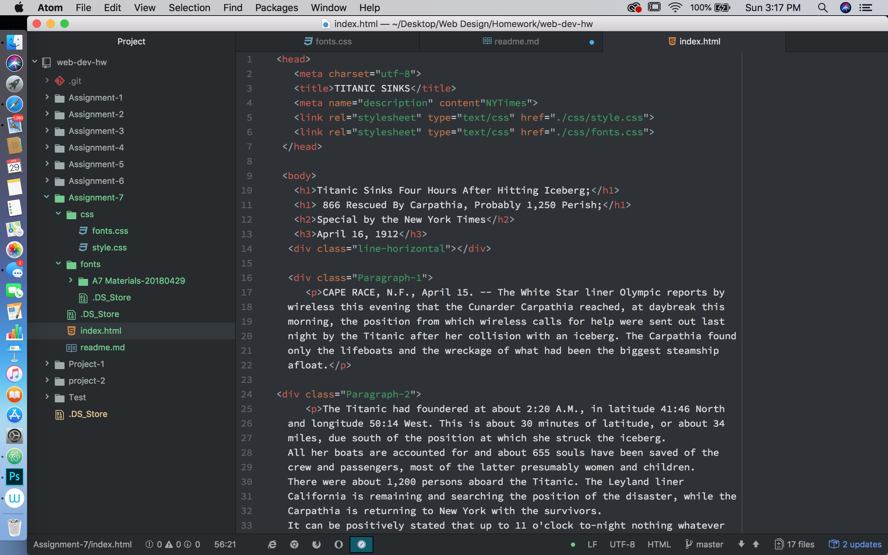

# Assignment-7: Typography

For my design I wanted to keep it simple. I have it looking like a breif article you
would find in the quick news sections. The fonts I used gave the page a look like the
information being read was from an old Western union telegram, to get this look I used
the Cinzel font. For the title I used Fjalla+One and EB+Garamond fonts which gave it
a newspaper headline look.

System fonts - Are already installed on your local device and system. These
are available to you and most programs you use, but are not necessarily to the web.

Web fonts - Are custom fonts hosted on a server. They do not have to be available on
the user's device to appear, but require certain elements to get called up correctly.

Web Safe fonts - Fonts that developers can count on being available by the system
are known as "web-safe" fonts. These include font families for both Windows and Mac.

Fallack fonts in a font stack are important because the font-family property should
contain the primary font choice, which is then followed with a comma-delineated,
list-of-fonts for the browser to try and load should the primary choice fail for
some reason.

This assignment was hard to digest, I'm sure that I am missing some elements for
my page. However, using the instructions as a guide helped out alot, this allowed
me to at least get the basics for typography on a website. In this assignment we
learned how to set up a webpage with specific typography to give the page character.

