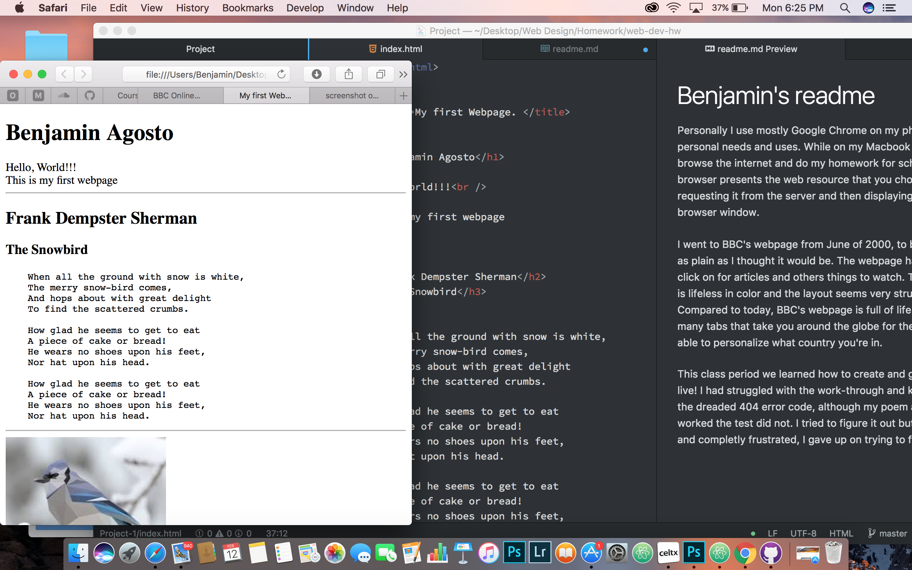

# Benjamin's readme

Personally I use mostly Google Chrome on my phone for personal needs and uses. While on my Macbook I use Safari to browse the internet and do my homework for school.
The browser presents the web resource that you choose by requesting it from the server and then displaying it in the browser window.

I went to BBC's webpage from June of 2000, to be honest its as plain as I thought it would be. The webpage has plain tabs to click on for articles and others things to watch. The page itself is lifeless in color and the layout seems very structured. Compared to today, BBC's webpage is full of life and color, many tabs that take you around the globe for the news and able to personalize what country you're in.

This class period we learned how to create and get a webpage live! I had struggled with the work-through and kept getting the dreaded 404 error code, although my poem and picture worked the test did not. I tried to figure it out but with no luck and completly frustrated I was unable to correct the error.

