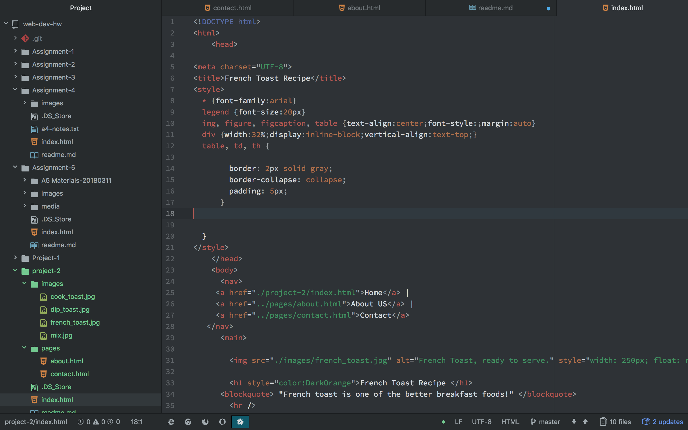

# Agosto Project-2
Learning HTML langauge coding was not easy to say the least.
I am a new coder and a new web designer, so this has been a little stressful if I must admit.
If i'm being completely honest, this class is a kick to the chest for me, I enjoy learning about making
websites, but not so much in the execution.

Next we move on to CSS, which helps decorate HTML. I'm not as stoked as I could be going into this, but I am anxious to see what CSS code can bring to HTML.

# Work Cycle
During this work cycle I leaned heaviy upon the old assignments that we did earlier. I was able to go back and use those as visual aids when I was writing up the code. I also worked with my buddy on this assignment, we would check over eachothers work to make sure their were no errors. We also would look at eachothers sites to make sure that they at least looked presentable. To help string myself along with this assignment, I used the TODO and refenced back at it when I ran into trouble. I had issues when trying to navigate back to my home page from the others, I was able to navigate from the home page back to the others but found out that I had issues when trying to return to the home page. This assignment was kind of a pain if I'm being honest because of the nice weather, but other than that it was business as usual.

